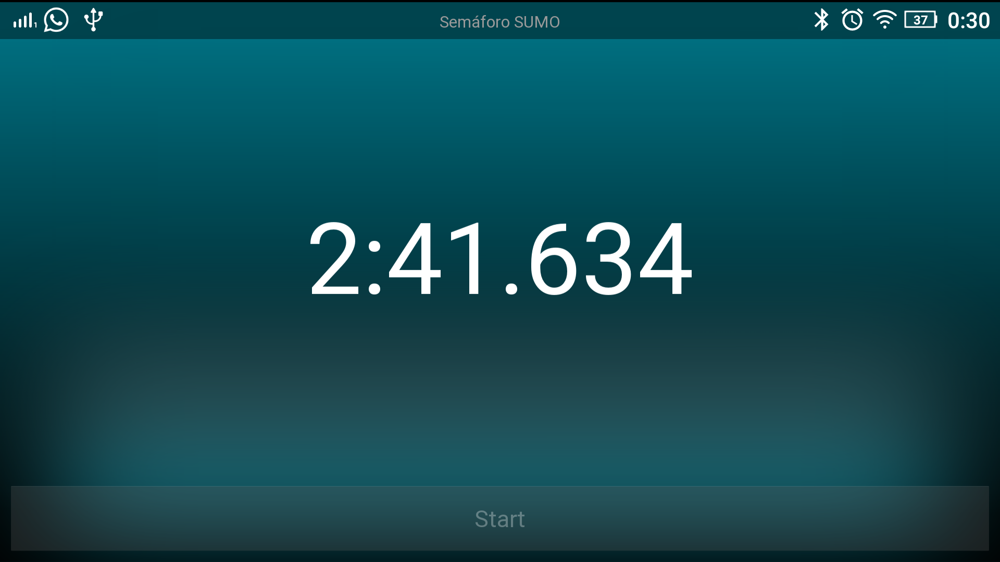

# Software para torneo de robótica

## Requisitos

- Python
- Kivy 1.9
- Adb (Android Debug Bridge)
  * https://dl.google.com/android/repository/platform-tools-latest-windows.zip
  * https://dl.google.com/android/repository/platform-tools-latest-linux.zip
  * https://dl.google.com/android/repository/platform-tools-latest-darwin.zip
- GNU Make
  * Viene incluido en Linux y Mac
  * https://sourceforge.net/projects/gnuwin32/files/make/3.81/make-3.81-bin.zip/download?use_mirror=ufpr&download=


## Ejecución local

```
make run
```


## Utilizando la aplicación Kivy Launcher

Kivy Launcher permite ejecutar proyectos Kivy sin necesidad de generar el APK.
Se descarga desde: https://play.google.com/store/apps/details?id=org.kivy.pygame&hl=es

### Copiando/Acutalizando el proyecto al dispositivo

```
make push
```

Una vez completado abrir Kivy Launcher y ejecutar la aplicación:




## Otros comandos

```
make shell
```

Abre una consola en le teléfono, para navegar a la ruta dónde se instalan las aplicaciones de kivy utilizar el comando:

```bash
cd /storage/emulated/legacy/kivy/
```

## Depuración

Una forma de depurar es utilizar la regla del `Makefile` llamada `phone_logs`, con esta se pueden ver los logs que captura Kivy durante la ejecución de nuestro programa:

```bash
make phone_logs
```

Un ejemplo de su salida se puede apreciar en el siguiente listado:
```
[INFO              ] Logger: Record log in /storage/sdcard0/kivy/robotchallenge/.kivy/logs/kivy_17-03-31_5.txt
[INFO              ] Kivy: v1.9.1
[INFO              ] Python: v2.7.2 (default, Mar 20 2016, 23:30:13) 
[GCC 4.8]
[INFO              ] Factory: 179 symbols loaded
[WARNING           ] stderr: /data/data/org.kivy.pygame/files/lib/python2.7/site-packages/kivy/core/image/img_pygame.py:13: RuntimeWarning: import cdrom: No module named cdrom
[WARNING           ] stderr: (ImportError: No module named cdrom)
[INFO              ] Image: Providers: img_tex, img_dds, img_gif, img_pygame, img_pil (img_ffpyplayer ignored)
[INFO              ] Text: Provider: pygame
[INFO              ] Window: Provider: pygame
[INFO              ] GL: OpenGL version <OpenGL ES 3.0 V@100.0 AU@ (GIT@Ibddc658e36)>
[INFO              ] GL: OpenGL vendor <Qualcomm>
[INFO              ] GL: OpenGL renderer <Adreno (TM) 405>
[INFO              ] GL: OpenGL parsed version: 3, 0
[INFO              ] GL: Texture max size <16384>
[INFO              ] GL: Texture max units <16>
[INFO              ] Support: Android install hooks
[INFO              ] Window: virtual keyboard not allowed, single mode, not docked
[INFO              ] Audio: Providers: audio_pygame (audio_pygst, audio_ffpyplayer ignored)
[INFO              ] DEBUG: %s
[WARNING           ] Factory: Ignored class "SemaforoSumo" re-declaration. Current -  module: None, cls: <class '__main__.SemaforoSumo'>, baseclass: None, filename: None. Ignored -  module: None, cls: None, baseclass: Screen, filename: ./semaforo.kv.
[WARNING           ] Factory: Ignored class "LightLabel" re-declaration. Current -  module: None, cls: <class '__main__.LightLabel'>, baseclass: None, filename: None. Ignored -  module: None, cls: None, baseclass: Label, filename: ./semaforo.kv.
[INFO              ] GL: NPOT texture support is available
[INFO              ] OSC: using <thread> for socket
[INFO              ] Base: Start application main loop
[INFO              ] Android: found 17 joystick
[INFO              ] Android: create joystick <0>
[INFO              ] Android: discard joystick <0> cause no button
[INFO              ] Android: create joystick <1>
[INFO              ] Android: create joystick <2>
[INFO              ] Android: create joystick <3>
[INFO              ] Android: create joystick <4>
[INFO              ] Android: create joystick <5>
[INFO              ] Android: create joystick <6>
[INFO              ] Android: create joystick <7>
[INFO              ] Android: create joystick <8>
[INFO              ] Android: create joystick <9>
[INFO              ] Android: create joystick <10>
[INFO              ] Android: create joystick <11>
[INFO              ] Android: create joystick <12>
[INFO              ] Android: create joystick <13>
[INFO              ] Android: create joystick <14>
[INFO              ] Android: create joystick <15>
[INFO              ] Android: create joystick <16>
[INFO              ] Android: Must go into sleep mode, check the app
[INFO              ] on_pause ()
[INFO              ] Android: App doesn't support pause mode, stop.
[INFO              ] Base: Leaving application in progress...

```